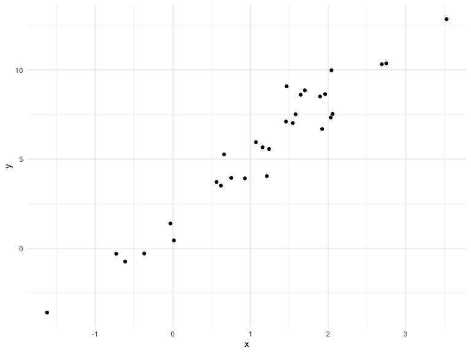

Writing Functions
================

## Get started

We’re going to write some functions.

Here’s z scores

``` r
x = rnorm(n = 30, mean = 4, sd = 2.3)
x_again = rnorm(n = 30, mean = 6, sd = .3) 
y = rnorm(n = 30, mean = 24, sd = 2.3)
(x - mean(x)) / sd(x)
```

    ##  [1]  0.75389256  2.24284065  0.59954433 -1.64765407 -1.05927652  1.11524415
    ##  [7]  0.10536547 -1.34635796  0.01998568 -0.71403775 -0.04054567  1.05111256
    ## [13] -0.45229772 -0.05494002  0.17548214  0.13321009 -1.24009961  1.33257077
    ## [19]  0.05853246 -1.74241409  0.65210497 -0.27192569 -0.81705170  0.70334361
    ## [25] -0.66935269 -0.04929313 -1.44751222  1.58496278  1.08995550 -0.06538888

``` r
(x_again - mean(x_again)) / sd(x_again)
```

    ##  [1]  1.94923515 -1.10185054  0.12904363  0.18571811  0.30541904  0.20707028
    ##  [7]  0.23420235  0.58031929 -1.04645238 -0.19729213 -0.58078839 -1.73900759
    ## [13] -0.29149266  1.54936823  2.03167132 -0.85796086 -0.43698815 -0.01647461
    ## [19]  0.91945061  0.88391277 -1.19450145  0.22676701 -0.92374677 -0.42517205
    ## [25]  2.04887872  0.22783476 -0.94376547 -1.18228461 -0.79390052  0.25278692

Now a function.

``` r
z_score = function(x_arg) {
  
  if (!is.numeric(x_arg)) {
    stop("x should be numeric")
  } else if (length(x_arg) < 3) {
    stop("x should be longer than 3")
  } 
  
  (x_arg - mean(x_arg)) / sd(x_arg)
  
}
```

Try out the
    function.

``` r
z_score(x_arg = y)
```

    ##  [1] -2.460419411 -0.287543131  0.633797177 -0.434665958 -0.595398348
    ##  [6]  0.266951836 -1.274826234 -0.773846432  0.006440758 -1.300294197
    ## [11] -0.350637254  1.971685550 -0.545449755 -0.377357703  0.161540518
    ## [16]  0.293819483  1.577655229 -0.193174140  0.870842249  0.101962599
    ## [21]  1.761109282  1.125617324 -0.825851332  0.063391040 -0.776650405
    ## [26]  0.056517983  0.158543650  1.657983423  0.612630475 -1.124374277

``` r
z_score(x_arg = 3)
```

    ## Error in z_score(x_arg = 3): x should be longer than 3

``` r
z_score(x_arg = "my name is jeff")
```

    ## Error in z_score(x_arg = "my name is jeff"): x should be numeric

``` r
z_score(x_arg = c(TRUE, TRUE, FALSE, TRUE))
```

    ## Error in z_score(x_arg = c(TRUE, TRUE, FALSE, TRUE)): x should be numeric

``` r
z_score(x_arg = iris)
```

    ## Error in z_score(x_arg = iris): x should be numeric

## Multiple outputs

``` r
mean_and_sd = function(input_x) {
  
  if (!is.numeric(input_x)) {
    stop("x should be numeric")
  } else if (length(input_x) < 3) {
    stop("x should be longer than 3")
  } 
  
  list(
    mean_input = mean(input_x),
    sd_input = sd(input_x),
    z_score = (input_x - mean(input_x)) / sd(input_x)
  )
  
}
```

test this function

``` r
mean_and_sd(input_x = y)
```

    ## $mean_input
    ## [1] 23.51372
    ## 
    ## $sd_input
    ## [1] 2.541323
    ## 
    ## $z_score
    ##  [1] -2.460419411 -0.287543131  0.633797177 -0.434665958 -0.595398348
    ##  [6]  0.266951836 -1.274826234 -0.773846432  0.006440758 -1.300294197
    ## [11] -0.350637254  1.971685550 -0.545449755 -0.377357703  0.161540518
    ## [16]  0.293819483  1.577655229 -0.193174140  0.870842249  0.101962599
    ## [21]  1.761109282  1.125617324 -0.825851332  0.063391040 -0.776650405
    ## [26]  0.056517983  0.158543650  1.657983423  0.612630475 -1.124374277

## Multiple inputs

``` r
sim_data = tibble(
  x = rnorm(30, mean = 1, sd = 1),
  y = 2 + 3 * x + rnorm(30, 0, 1)
)
sim_data %>% 
  ggplot(aes(x = x, y = y)) + 
  geom_point()
```



``` r
ls_fit = lm(y ~ x, data = sim_data)
  
beta0_hat = coef(ls_fit)[1]
beta1_hat = coef(ls_fit)[2]
```

``` r
sim_regression = function(n, beta0 = 2, beta1 = 3) {
  
  sim_data = tibble(
    x = rnorm(n, mean = 1, sd = 1),
    y = beta0 + beta1 * x + rnorm(n, 0, 1)
  )
  
  ls_fit = lm(y ~ x, data = sim_data)
  
  tibble(
    beta0_hat = coef(ls_fit)[1],
    beta1_hat = coef(ls_fit)[2]
  )
  
}
sim_regression(n = 3000, beta0 = 17, beta1 = -3)
```

    ## # A tibble: 1 x 2
    ##   beta0_hat beta1_hat
    ##       <dbl>     <dbl>
    ## 1      17.0     -3.01

``` r
sim_regression(n = 14, beta0 = 24)
```

    ## # A tibble: 1 x 2
    ##   beta0_hat beta1_hat
    ##       <dbl>     <dbl>
    ## 1      24.6      2.60

## Scrape lots of napoleon

``` r
url = "https://www.amazon.com/product-reviews/B00005JNBQ/ref=cm_cr_arp_d_viewopt_rvwer?ie=UTF8&reviewerType=avp_only_reviews&sortBy=recent&pageNumber=1"
dynamite_html = read_html(url)
review_titles = 
  dynamite_html %>%
  html_nodes("#cm_cr-review_list .review-title") %>%
  html_text()
review_stars = 
  dynamite_html %>%
  html_nodes("#cm_cr-review_list .review-rating") %>%
  html_text()
review_text = 
  dynamite_html %>%
  html_nodes(".review-text-content span") %>%
  html_text()
reviews = tibble(
  title = review_titles,
  stars = review_stars,
  text = review_text
)
```

Now as a function

``` r
read_page_reviews = function(page_url) {
  
  dynamite_html = read_html(page_url)
  review_titles = 
    dynamite_html %>%
    html_nodes("#cm_cr-review_list .review-title") %>%
    html_text()
  review_stars = 
    dynamite_html %>%
    html_nodes("#cm_cr-review_list .review-rating") %>%
    html_text()
  
  review_text = 
    dynamite_html %>%
    html_nodes(".review-text-content span") %>%
    html_text()
  
  reviews = tibble(
    title = review_titles,
    stars = review_stars,
    text = review_text
  )
  
  reviews
    
}
```

Now i can read a lot of page reviews\! Although I’m back to
copy-and-pasting code
…

``` r
read_page_reviews("https://www.amazon.com/product-reviews/B00005JNBQ/ref=cm_cr_arp_d_viewopt_rvwer?ie=UTF8&reviewerType=avp_only_reviews&sortBy=recent&pageNumber=1")
```

    ## # A tibble: 0 x 3
    ## # … with 3 variables: title <chr>, stars <chr>, text <chr>

``` r
read_page_reviews("https://www.amazon.com/product-reviews/B00005JNBQ/ref=cm_cr_arp_d_viewopt_rvwer?ie=UTF8&reviewerType=avp_only_reviews&sortBy=recent&pageNumber=2")
```

    ## # A tibble: 0 x 3
    ## # … with 3 variables: title <chr>, stars <chr>, text <chr>

``` r
read_page_reviews("https://www.amazon.com/product-reviews/B00005JNBQ/ref=cm_cr_arp_d_viewopt_rvwer?ie=UTF8&reviewerType=avp_only_reviews&sortBy=recent&pageNumber=3")
```

    ## # A tibble: 0 x 3
    ## # … with 3 variables: title <chr>, stars <chr>, text <chr>

``` r
read_page_reviews("https://www.amazon.com/product-reviews/B00005JNBQ/ref=cm_cr_arp_d_viewopt_rvwer?ie=UTF8&reviewerType=avp_only_reviews&sortBy=recent&pageNumber=4")
```

    ## # A tibble: 0 x 3
    ## # … with 3 variables: title <chr>, stars <chr>, text <chr>

## Scoping

Mean example …

``` r
f = function(x) {
  z = x + y
  z
}
x = 1
y = 2
f(x = 2)
```

    ## [1] 4
